# Professional Portfolio Website

Leigh Poulier, September 2021

Published site: [https://leighpoulier.github.io](https://leighpoulier.github.io)  
Github Repo: [https://github.com/leighpoulier/portfolio](https://github.com/leighpoulier/portfolio)

## Purpose

This website is designed to showcase my abilities in HTML and CSS to a prospective employer.  It includes professional and educational history, personal information and contact links to various online presences.  There is also a blog section, which is designed to showcase techniques in HTML and CSS to build a functional blog type site.

## Description

The site is designed for three main form factors: mobile, tablet, and desktop.  Each page of the site is responsive to changes in screen width between the three forms as follows:

Form | Screen Width
-|-
Mobile|less than 550 pixels
Tablet|550 - 999 pixels
Desktop|1000px and greater

The website was developed in pure HTML and CSS, using VS Code, and tested with Google Chrome and Mozilla Firefox for desktop, iOS and Android.  It is deployed on Github Pages.

### Theme

The website engages the user with a vibrantly coloured neon on black theme, using a palette of 6 neon colours on a dark background with glowing effects.  Most graphical components are hexagonal shaped and some are arranged into groups of interlocking hexagons.

### Headings

Many of the high level headings are implemented using vector graphics of my own handwriting, which in most cases are included inline with the HTML so they can be dynamically coloured.

### Links

Except when inline to a paragraph, most links are implemented as hexagonal icon images.  These links indicate their interactivity by reacting to click/touch with inversion of their colours.  On desktop when hovered or active they will also grow slightly.

## Sitemap

The website consists of four main pages:

- Home
- About Me
- Blog 
- Contact

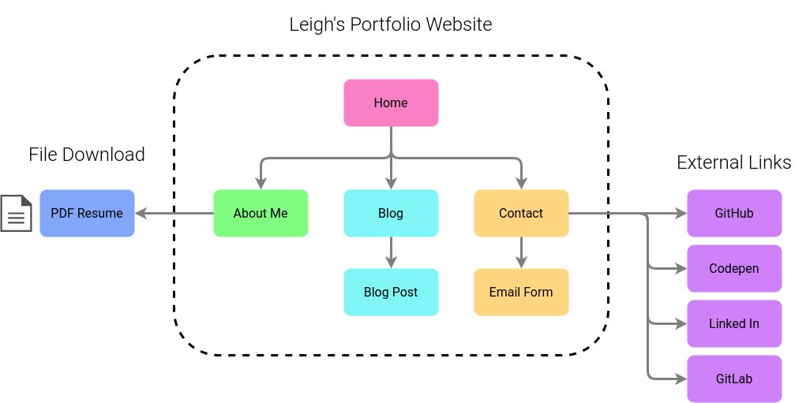

## Functionality and Features

### Home

The home page (index.html) is the main landing page, and its main content is prominent links to the other three sections.

On mobile, the content is arranged in a narrower space, but the hexagon arrangement widens out for tablet and desktop (see below).

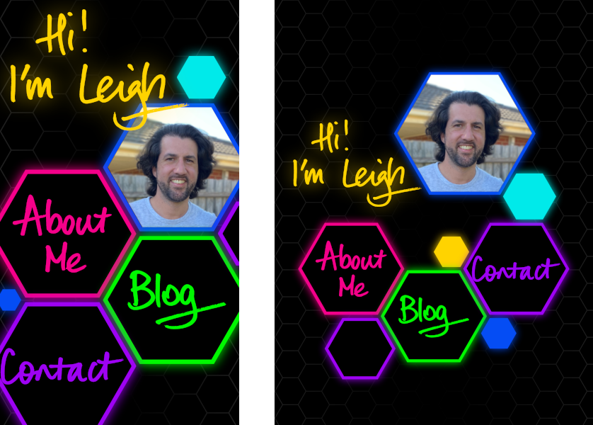
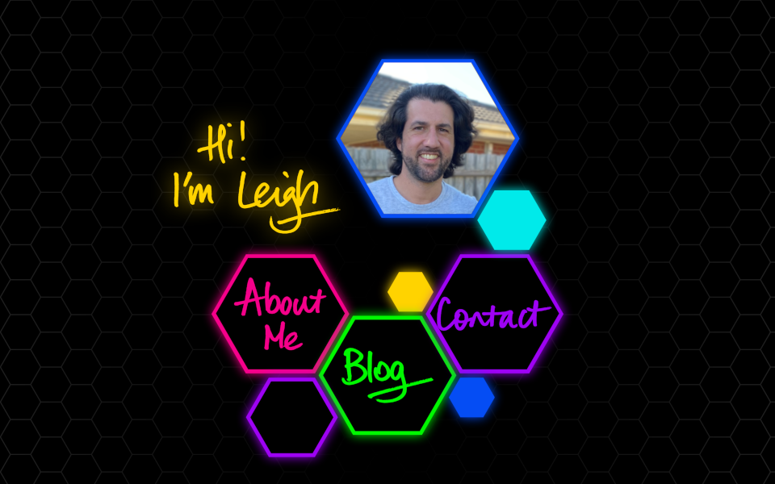

### Navigation

Navigation from the home page to the other three pages is accomplished via the prominent hexagonal links forming the main content of the page (see above).

On every other page, a hexagonal hamburger menu (mobile) or nav bar (tablet and desktop) is provided to enable access back to the home page, or directly to any of the three other main pages (About Me, Blog, or Contact).

#### Navigation on Mobile:

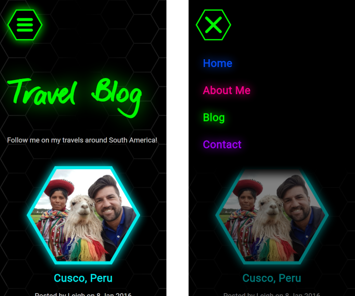

On mobile, a fixed position floating hamburger menu is provided, which when touched opens a drawer menu containing links to the main 4 pages.  The menu will close again when the X button is touched, or when the user touches the lower section of the screen outside the floating menu.

Each menu item is colour coded to the colours used on the destination page.

#### Navigation on Tablet and Desktop:

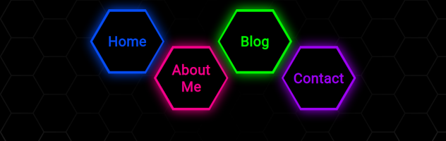

On tablet and desktop, a floating fixed navbar is provided at the top of the screen.  On tablet it is centred, and on desktop it is aligned to the right of the screen.  A semi transparent mask is provided below the nav controls to improve contrast with the underlying content when the page is scrolled.

### About Me

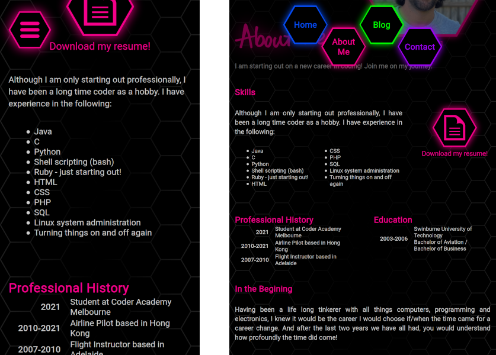
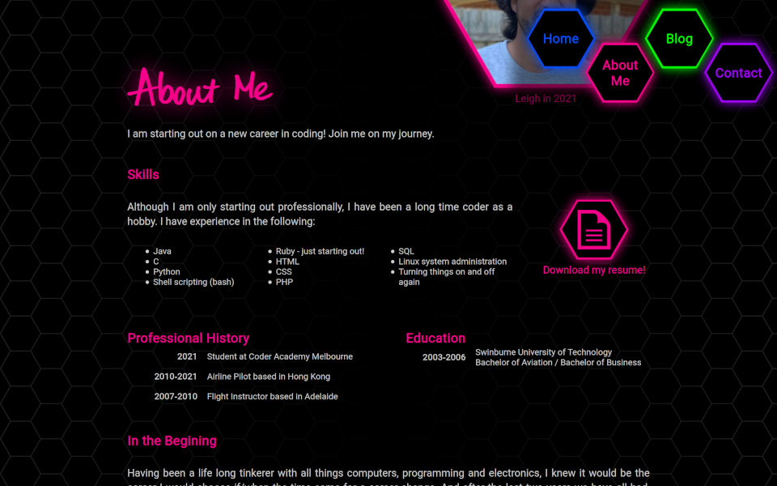

The "About Me" page (aboutme.html) provides a prospective employer with information about my programming and development experience (in an unordered list element), and professional and educational history (in tables). It also includes a section describing my past life, my interests and hobbies, and some images for decoration.  Each section of this page starts with an h2 heading and is enclosed in section tags, and the entire content is enclosed in an article element.

A link is provided so that a prospective employer may download a pdf version of my resume, however at this stage the pdf is only a placeholder.

### Blog List

The "Blog" page (blog.html) showcases my ability to create a functioning blog style website.  Real abridged entries from my 2016 travel blog are used as content in this demonstration.

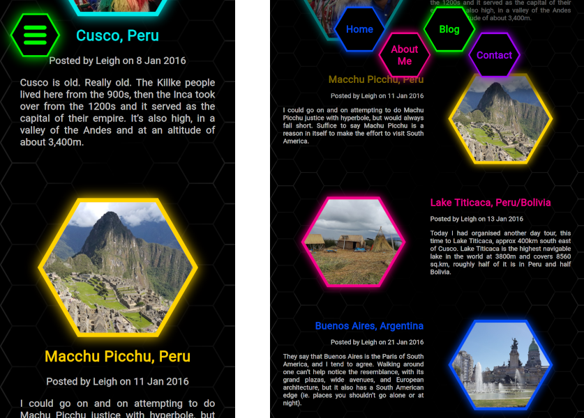

The initial blog page provides a list of five blog entries, each depicted on a panel with an image, a heading, date published, and an introductory paragraph. On mobile these panels arrange their content vertically, and on tablet and desktop they change to horizontal.  The list, however, always runs down the page.  Each blog entry panel is implemented in its own article element, and is depicted in a different colour relating to its target page colour.

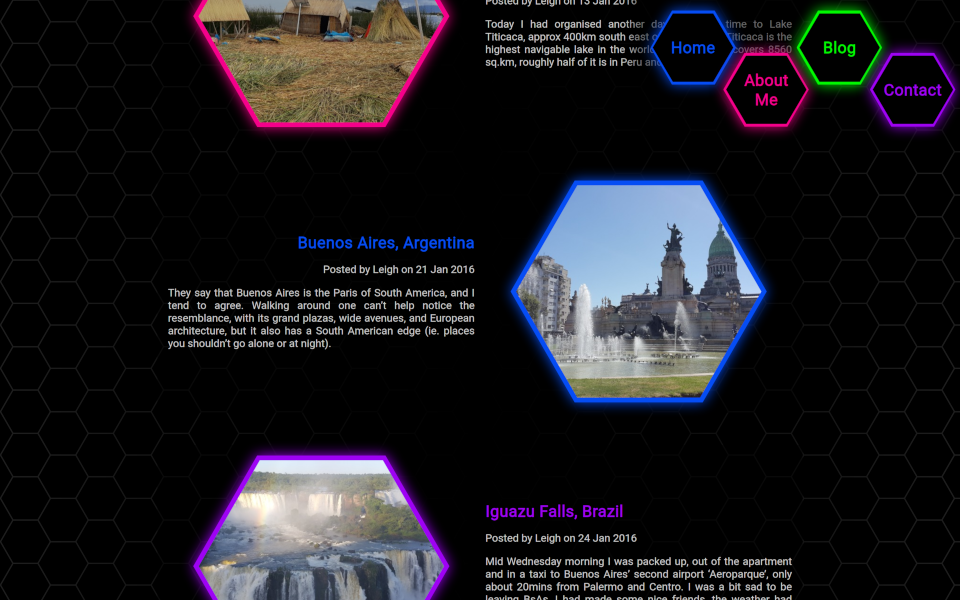

Each panel is a link providing access to the detail of that blog post.  There are five blog posts included, each on a separate page stored in the ./blog directory and named blog-post-#.html where # is a number 1-5.

### Blog Entry

Following the links provided by the panels on the inital blog page will direct the browser to one of these five blog post pages.  On each blog post page, the entire blog post is implemented as one big article, and the text of the blog post is interspersed with images which are inside figure elements.

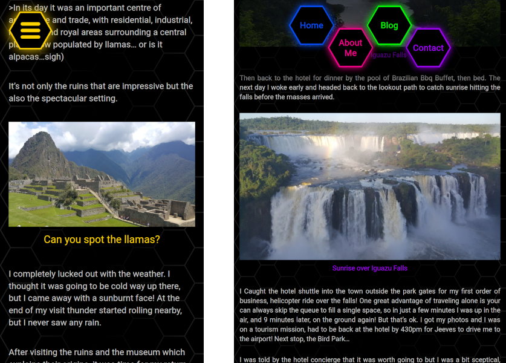

On Desktop, some of these images are floated left or right so the paragraph text floats around them.

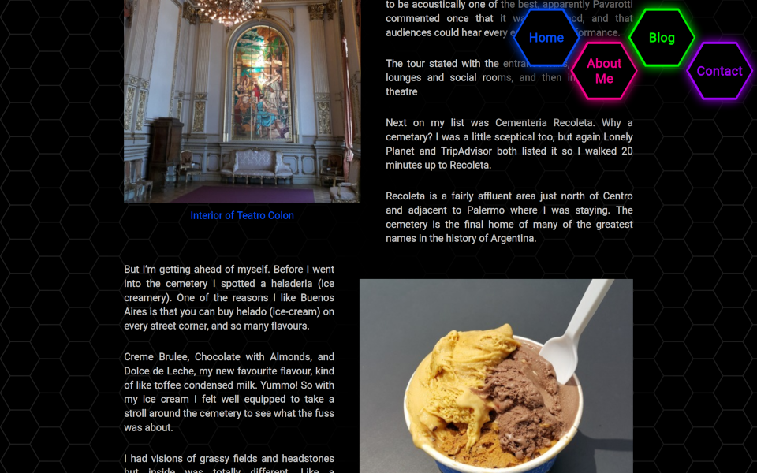

At the bottom of each blog post the hexagon icon link is reused to provide a quick way to go back to the Blog List Page.

### Contact

The "Contact" page (contact.html) provides different methods for a prospective employer to get more information about my work, by providing external links to my online profiles on various social media and collaboration websites.

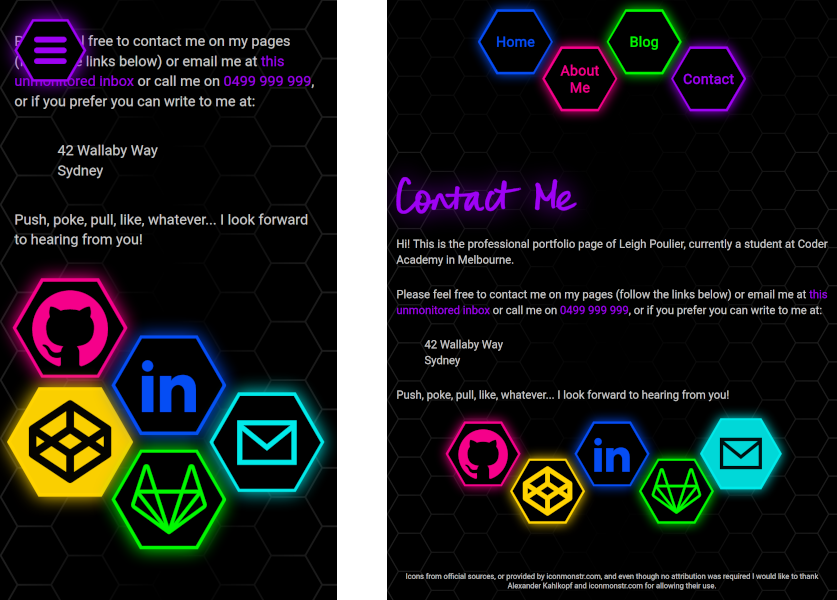

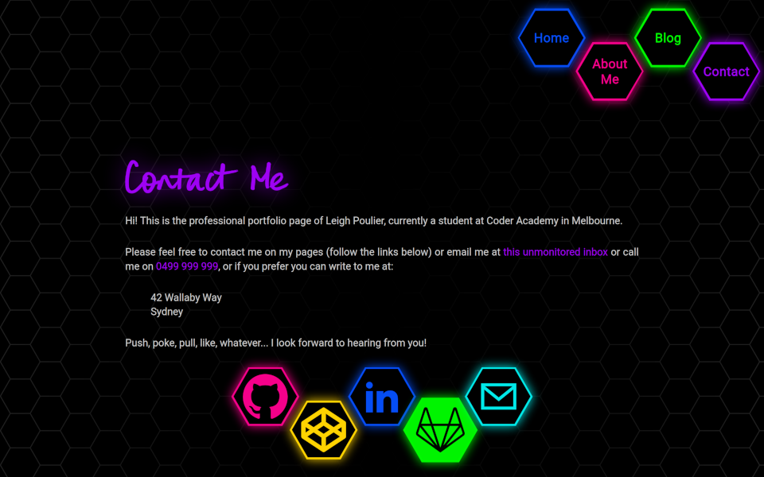

Links are presented in a honeycomb arrangement that adapts from mobile to tablet/desktop, and respond to touch/click/hover with inverted colours and growing slightly larger (see above).  All these links except the last icon (email) are external.

### Email

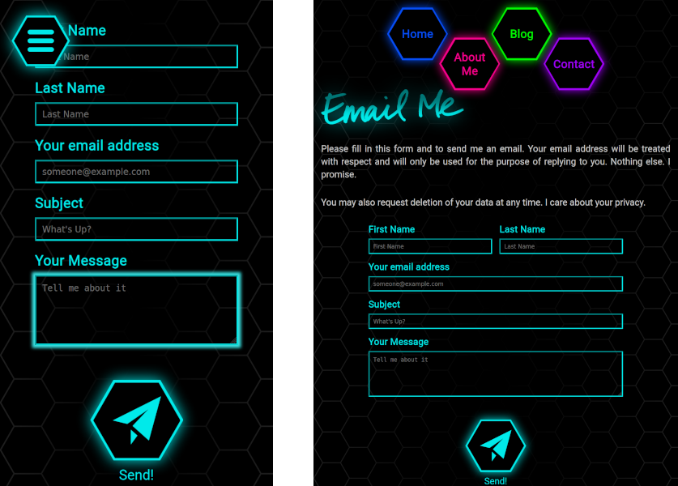
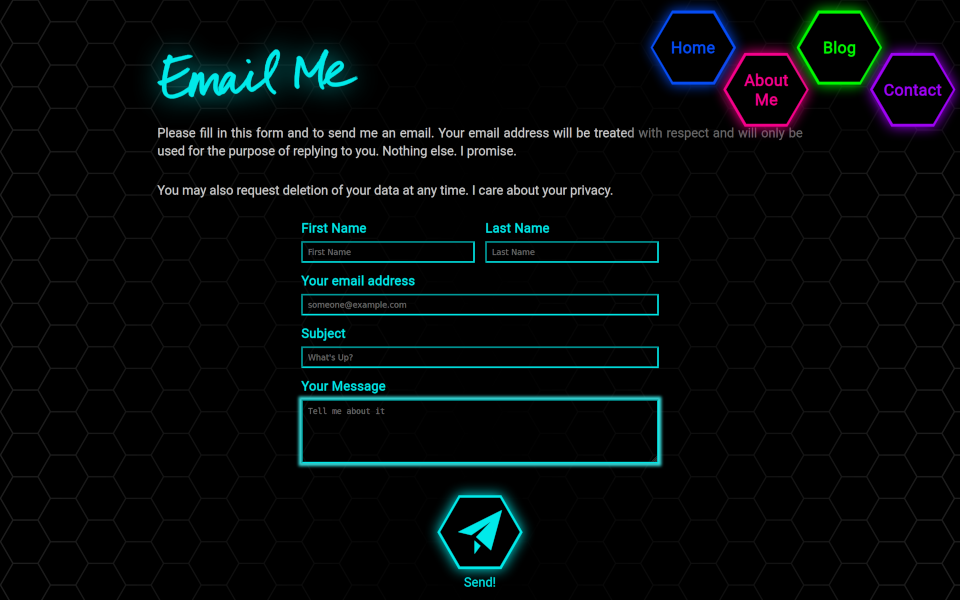

Clicking the last link takes the user to an internal page designed to allow the user to contact me via email.  A HTML Form is provided with fields for name, email, subject and message, and the hexagonal icon link component is reused as a submit button.  Unfortunately at this stage the form is not yet functional, because of server side scripting requirements to provide the email service.  Clicking the send button currently has no function.
