# Professional Portfolio Website

Leigh Poulier, September 2021

Published site: [https://leighpoulier.github.io](https://leighpoulier.github.io)  
Github Repo: [https://github.com/leighpoulier/portfolio](https://github.com/leighpoulier/portfolio)

## Contents

1. [Purpose](#purpose)
2. [Description](#description)
    1. [Theme](#theme)
    2. [Headings](#headings)
    3. [Links](#links)
3. [Sitemap](#sitemap)
3. [Walkthrough](#walkthrough)
    1. [Home](#home)
    2. [Navigation](#navigation)
        1. [Navigation on Mobile](#navigation-on-mobile)
        2. [Navigation on Tablet and Desktop](#navigation-on-tablet-and-desktop)
    3. [About Me](#about-me)
    4. [Blog List](#blog-list)
    5. [Blog Post](#blog-post)
    6. [Contact](#contact)
    7. [Email](#email)
4. [Components](#components)
    1. [Text Components](#text-components)
    2. [Graphical Components](#graphical-components)
5. [Subresource Integrity (SRI)](#subresource-integrity-sri)
6. [Accessibility](#accessibility)
## Purpose

This website is designed to showcase my abilities in HTML and CSS to a prospective employer.  It includes professional and educational history, personal information and contact links to various online presences.  There is also a blog section, which is designed to showcase techniques in HTML and CSS to build a functional blog type site.

## Description

The site is designed for three main form factors: mobile, tablet, and desktop.  Each page of the site is responsive to changes in screen width between the three forms as follows:

Form | Screen Width
-|-
Mobile|less than 550 pixels
Tablet|550 - 999 pixels
Desktop|1000px and greater

The website was developed in pure HTML and CSS, using VS Code, and tested with Google Chrome and Mozilla Firefox for desktop, iOS and Android.  It is deployed on Github Pages.

### Theme

The website engages the user with a vibrantly coloured neon on black theme, using a palette of 6 neon colours on a dark background with glowing effects.  Most graphical components are hexagonal shaped and some are arranged into groups of interlocking hexagons.

There are multiple animation effects used on active components to engage with the user.

### Headings

Many of the high level headings are implemented using vector graphics of my own handwriting, which in most cases are included inline with the HTML so they can be dynamically coloured.

### Links

Except when inline to a paragraph, most links are implemented as hexagonal icon images.  These links indicate their interactivity by reacting to click/touch with inversion of their colours.  On desktop when hovered or active they will also grow slightly.

## Sitemap

The website consists of four main pages:

- Home
- About Me
- Blog 
- Contact

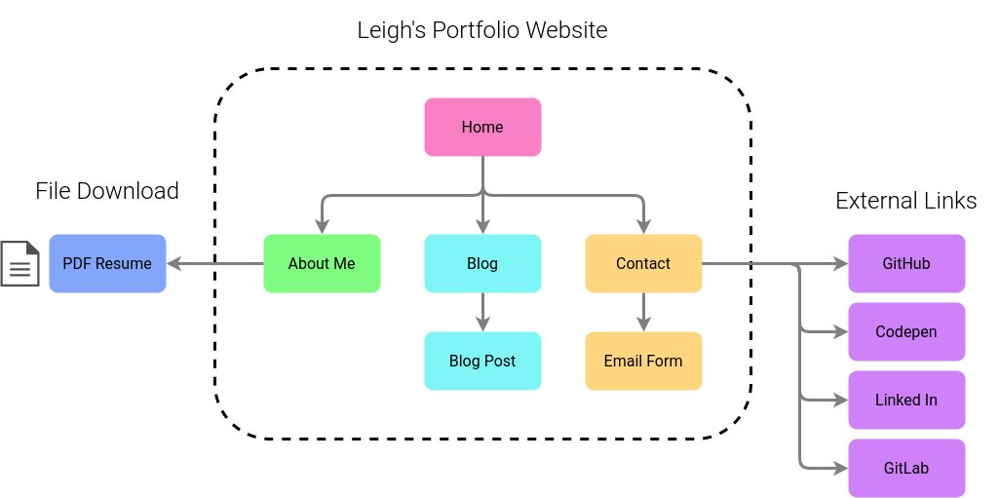

## Walkthrough

### Home

The home page (index.html) is the main landing page, and its main content is prominent links to the other three sections.

On mobile, the content is arranged in a narrower space, but the hexagon arrangement widens out for tablet and desktop (see below).

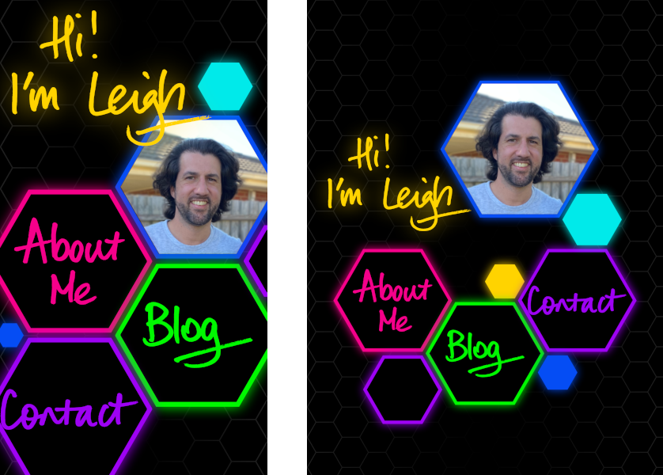
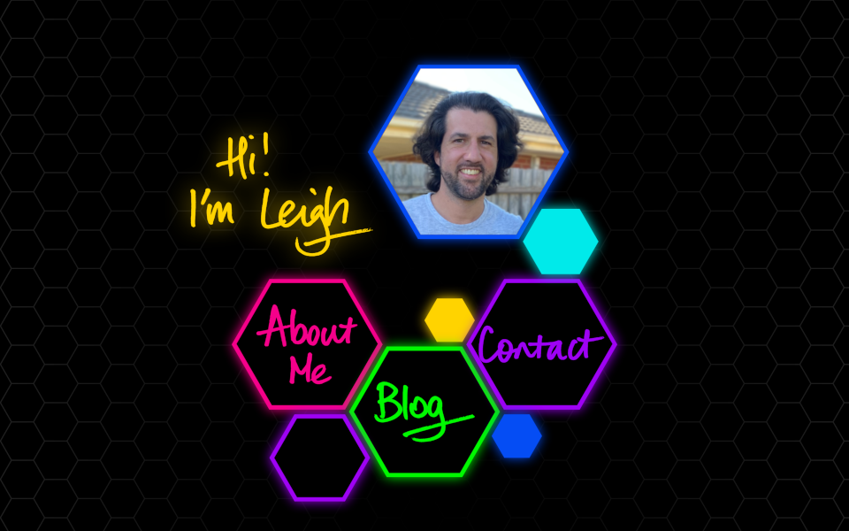

### Navigation

Navigation from the home page to the other three pages is accomplished via the prominent hexagonal links forming the main content of the page (see above).

On every other page, a hexagonal hamburger menu (mobile) or nav bar (tablet and desktop) is provided to enable access back to the home page, or directly to any of the three other main pages (About Me, Blog, or Contact).

#### Navigation on Mobile

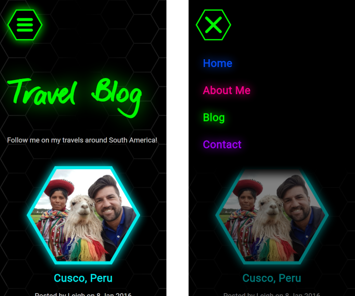

On mobile, a fixed position floating hamburger menu is provided, which when touched opens a drawer menu containing links to the main 4 pages.  The menu will close again when the X button is touched, or when the user touches the lower section of the screen outside the floating menu.

Each menu item is colour coded to the colours used on the destination page.

#### Navigation on Tablet and Desktop

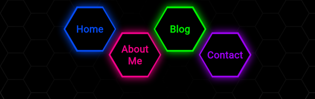

On tablet and desktop, a floating fixed navbar is provided at the top of the screen.  On tablet it is centred, and on desktop it is aligned to the right of the screen.  A semi transparent mask is provided below the nav controls to improve contrast with the underlying content when the page is scrolled.

### About Me

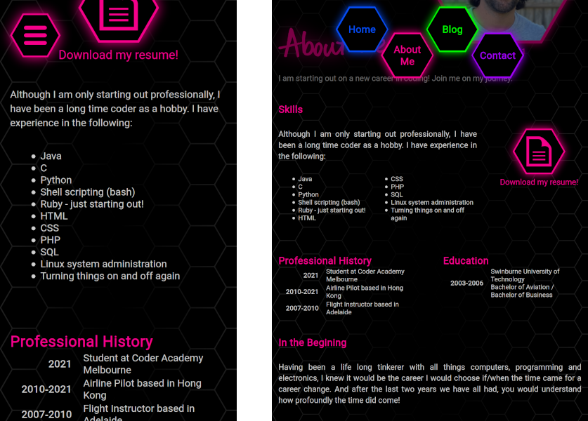
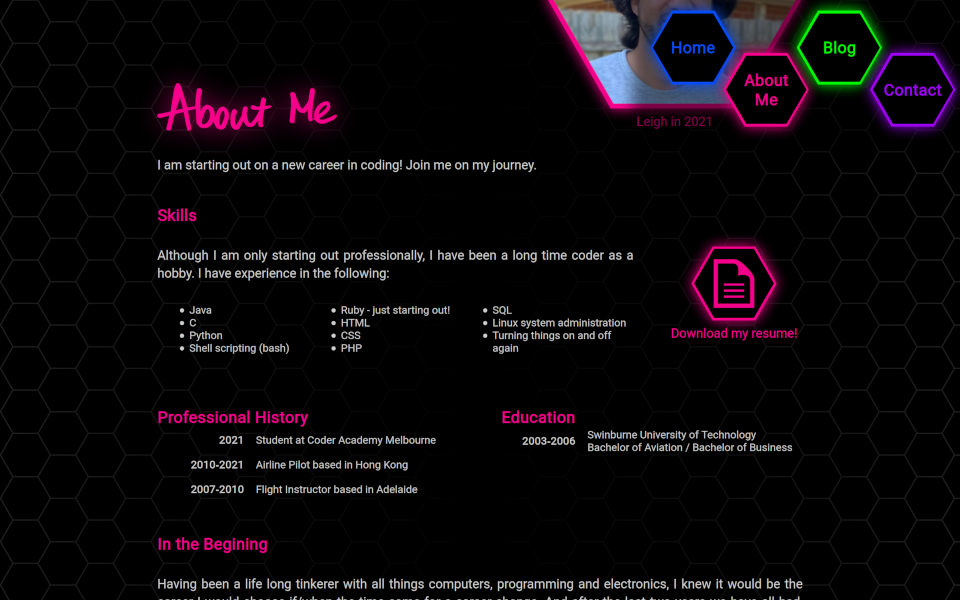

The "About Me" page (aboutme.html) provides a prospective employer with information about my programming and development experience (in an unordered list element), and professional and educational history (in tables). It also includes a section describing my past life, my interests and hobbies, and some images for decoration.  Each section of this page starts with an h2 heading and is enclosed in section tags, and the entire content is enclosed in an article element.

A link is provided so that a prospective employer may download a pdf version of my resume, however at this stage the pdf is only a placeholder.

### Blog List

The "Blog" page (blog.html) showcases my ability to create a functioning blog style website.  Real abridged entries from my 2016 travel blog are used as content in this demonstration.

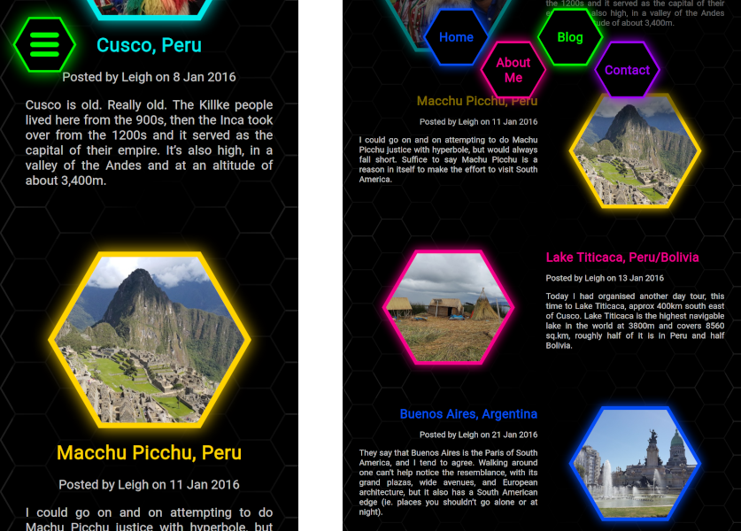

The initial blog page provides a list of five blog entries, each depicted on a panel with an image, a heading, date published, and an introductory paragraph. On mobile these panels arrange their content vertically, and on tablet and desktop they change to horizontal.  The list, however, always runs down the page.  Each blog post summary panel is implemented in its own article element, and is depicted in a different colour relating to its target page colour.

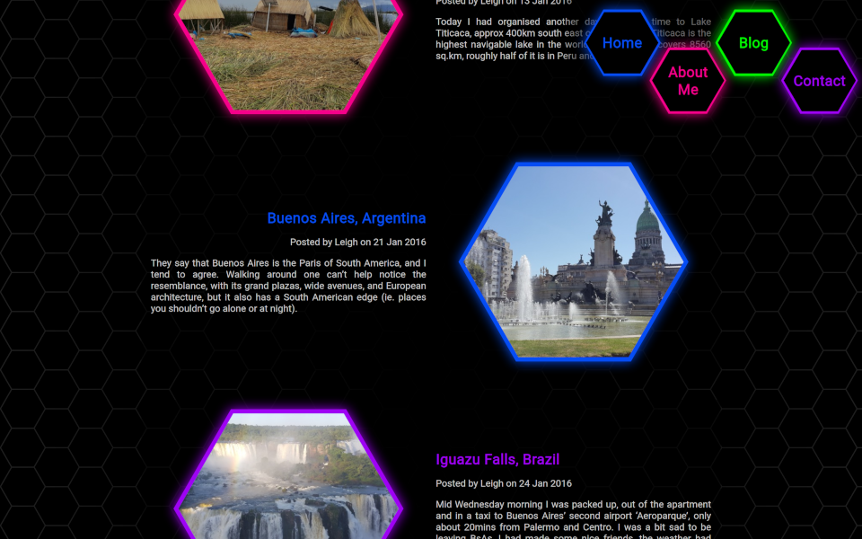

Each panel is a link providing access to the detail of that blog post.  There are five blog posts included, each on a separate page stored in the ./blog directory and named blog-post-#.html where # is a number 1-5.

### Blog Post

Following the links provided by the panels on the inital blog page will direct the browser to one of the five blog post pages.  On each blog post page, the entire blog post is implemented as one big article, and the text of the blog post is interspersed with images which are inside figure elements.

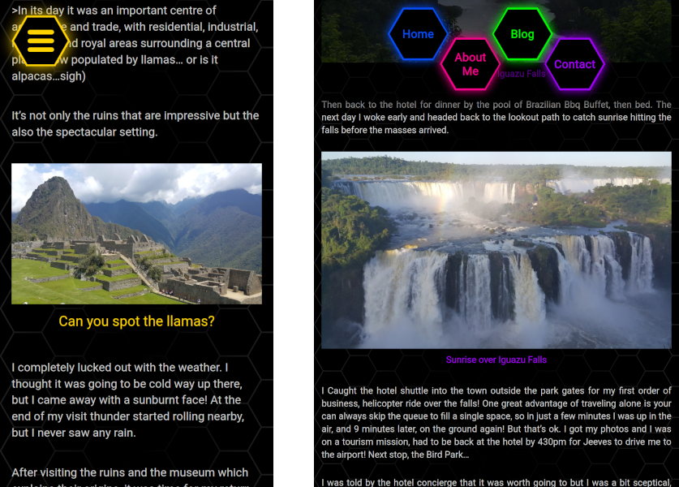

On Desktop, some of these images are floated left or right so the paragraph text floats around them.

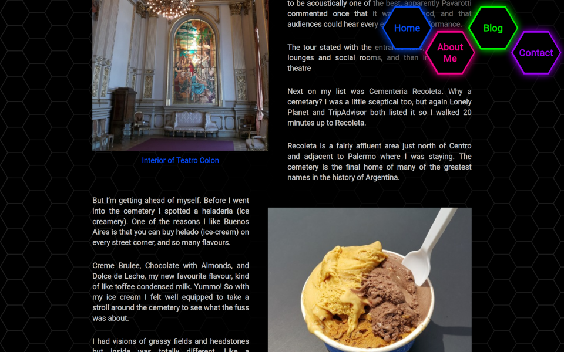

At the bottom of each blog post the hexagon icon link is reused to provide a quick way to go back to the Blog List Page.

### Contact

The "Contact" page (contact.html) provides different methods for a prospective employer to get more information about my work, by providing external links to my online profiles on various social media and collaboration websites.

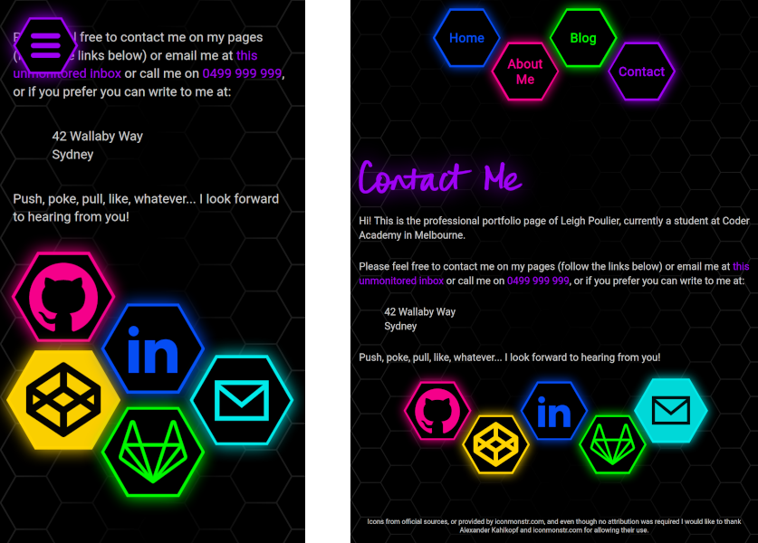

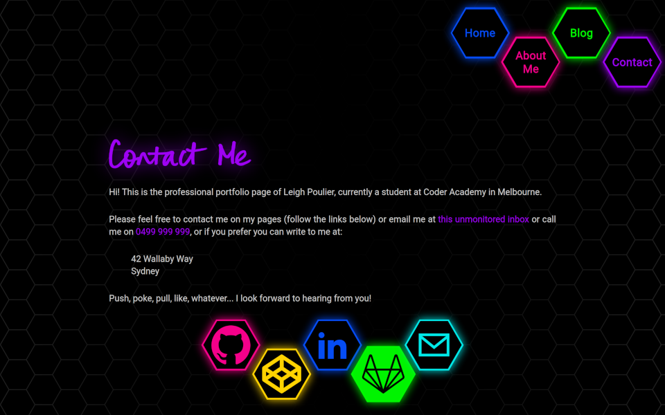

Links are presented in a honeycomb arrangement that adapts from mobile to tablet/desktop, and respond to touch/click/hover with inverted colours and growing slightly larger (see above).  All these links except the last icon (email) are external.

### Email

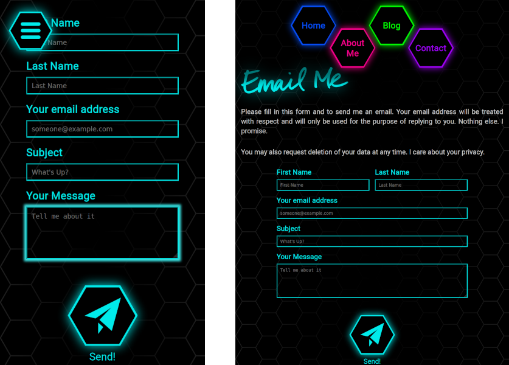
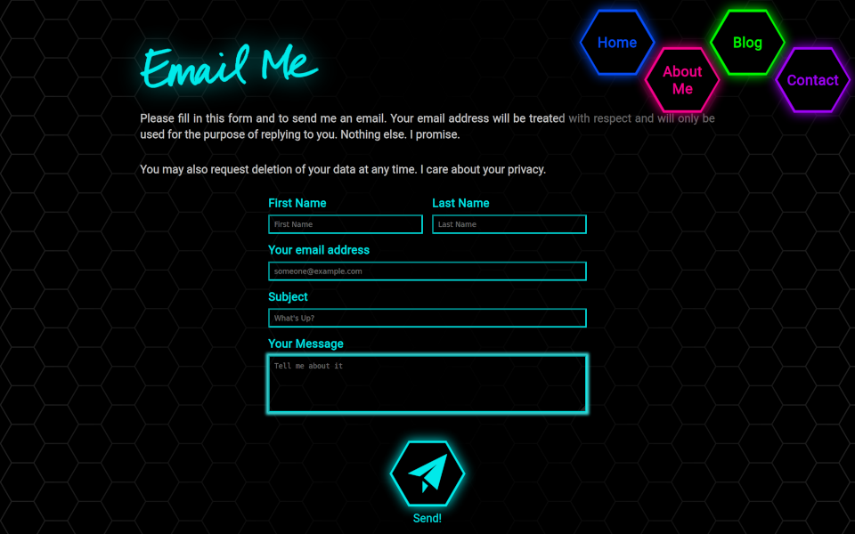

Clicking the last link takes the user to an internal page designed to allow the user to contact me via email.  A HTML Form is provided with fields for name, email, subject and message, and the hexagonal icon link component is reused as a submit button.  Unfortunately at this stage the form is not yet functional, because of server side scripting requirements to provide the email service.  Clicking the send button currently has no function.

## Components

### Text Components

The following text based components are used on the site:

1. Navigation Menu (mobile) / Navigation Bar (tablet and desktop).  
This component is reused on all pages except the home page (index.html). Both are based on the same HTML, but CSS with @media queries switches the appearance between the two.

    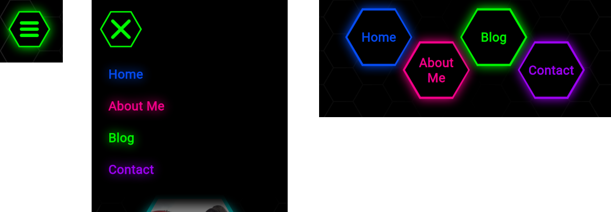

2. Email form.   
This component appears on the email page (email.html).  Even though this form is not actually functional, it is a styled component.  The default browser styling is largely overwitten to make the form appear similarly themed to the rest of the site.

    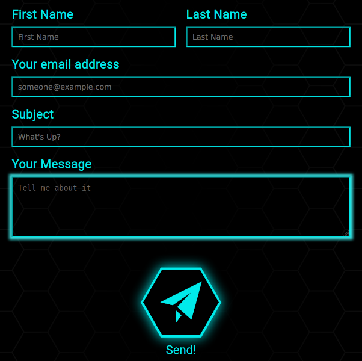

3. Blog Post Summary
This component is repeated 5 times on the blog list page (blog.html).  It is a composite component with image and text arranged in nested divs using flexbox using an article element.

    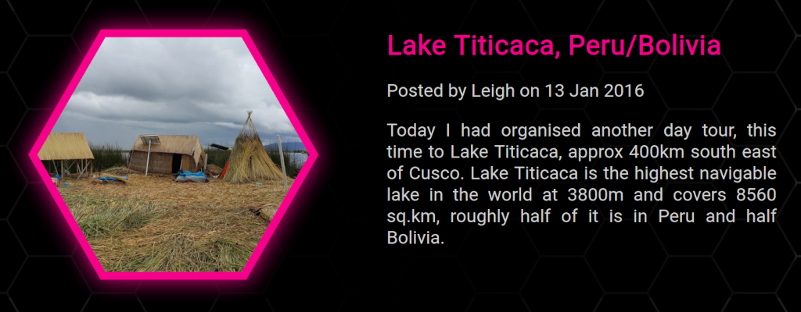

4. Paragraph  
The paragraph component is styled uniformly and used throughout the site, mostly on the "About Me" and "Blog Post" pages.

    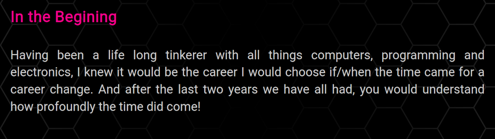

### Graphical Components

1. Inline SVG Vector Handwritten Headings  
These headings are used across the site for the main headings of each page.  SVG images can be added inline because they are also XML documents, very similar to HTML.  This enables them to be embeded into the document structure and be referenced and styled like HTML.  In particular the colour of each heading is styled dynamically and can be easily changed in css.  It is currently determined by a small amount of inline css which is different in every html document. A drop shadow effect is added in the css.

    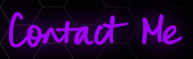

2. Hexagon shape  
This component is used extensively throughout the site. It appears in various sizes, and colours, in various implementations.  It is used as a basic shape, and as a border for images and icons.

    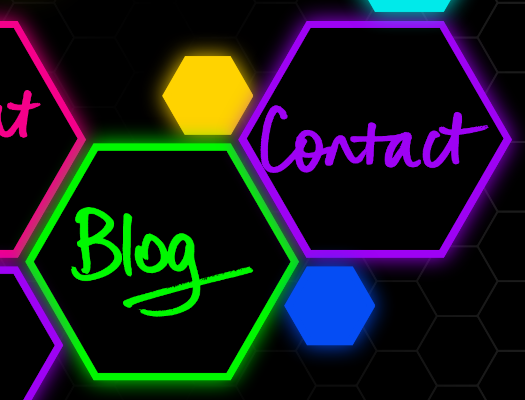

3. Hexagonal Figure  
Building on the hexagon shape component, most images are presented inside a hexagonal shape with a border and glow effect, and enclosed in a figure element, with a figcaption for description.  These components appear on the "About Me" page and also on the "Blog List" page.

    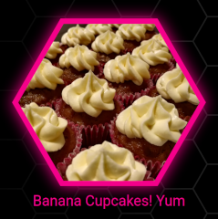

4. Hexagonal link icon  
Any graphical link across the site is implemented using this component.  The hexagonal link icon component is another extension of the hexagon shape component, with added animation effects for growing an hover/focus, and colour inversion of the icon inside the hexagon.  These components can be seen on the "About Me" page (PDF Resume link), on the "Contact" page (external site links), and on the "Email" page (send email button).

    

5. Floating photos
To ensure that images can be viewed without being clipped, hexagon shapes are not used to display phots on the "Blog Post" pages.  These floating image components are used instead, and are again enclosed in a figure element with a figcaption.  Some of these photos are styled to float left or right and allow paragraph text to flow around.

    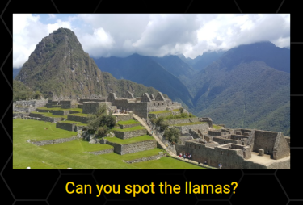

## Subresource Integrity (SRI)

In the head element of each page are links to two css files (styles.css and colours.css) and one javascript file (script.js) and these links all contain SHA-512 hashes to ensure data integrity and security.

The Font "Roboto", provided by Google Fonts, is also linked in all pages, however as per [this discussion on Google Fonts github page](https://github.com/google/fonts/issues/473) SRI is not supported for Google Fonts because the css returned to the browser is dynamically optimised based on the requesting User Agent (operating system and browser identifying information).  Therefore SRI is not implemented on these links.

## Accessibility

To enable navigation by users with screen readers, all images contain alt attributes with descriptions.
### Handwritten Headings

The SVG Headings are images and could pose a problem to a screen reader attempting to navigate the page structure. To try and alleviate this problem, the SVG headings are still wrapped in h1 tags to indicate their function in the structure of the page.

Normally the alt attribute would provide the description to a screen reader but for SVG specifically a title element is included as the first child of the svg element to provide a description of the image to the user and a screen reader.  Title elements are included on all inline SVG images to maximise accessibility.

More info: [MDN Web Docs](https://developer.mozilla.org/en-US/docs/Web/SVG/Element/title) and [W3C](https://www.w3.org/TR/SVG2/struct.html#DescriptionAndTitleElements)
